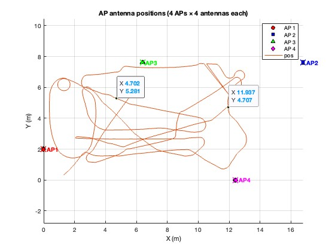
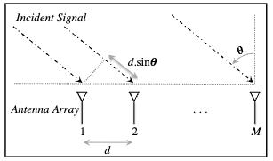

# Practical WiFi Signal Processing CSCI4900/6900

The **WILD datasets** are documented here:  
[WILD Dataset Description](https://github.com/ucsdwcsng/DLoc_pt_code/blob/main/wild.md)

This repository is used to illustrate how we process the raw WiFi CSI data. It is built upon the feature extraction pipeline from:  
[CSI_to_DLocFeatures](https://github.com/ucsdwcsng/CSI_to_DLocFeatures).

# AoA–ToF Multipath Profile Math Model

This section explains how to compute the **Angle-of-Arrival (AoA) – Time-of-Flight (ToF)** multipath profile from CSI.

---
We have four aps, and every AP has 4 antennas.
. 

The CSI data is named as channels_<setup_name_from_above>.mat. These MATLAB files contain the following variables:

- channels: [ n_datapoints x n_frequency x n_ant X n_ap ] 4D complex channel matrix.
- RSSI: [ n_datapoints x n_ap ] 2D recieved signal strenght matrix.
- labels: [ n_datapoints x 2 ] 2D XY labels.
- opt: various options specific to the data generated 
    - -opt.freq : [n_frequencyx1] 1D vector that describes the frequency of the subcarriers 
    - -opt.lambda: [n_frequencyx1] 1D vector that describes the wavelength of the subcarriers 
    - -ant_sep: antenna separation used on all of our APs
- ap: n_ap cell matrix. Each element corresponds to [ n_ant x 2 ] XY locations of the n_ant on each AP.
- ap_aoa: [ n_ap x 1] vectors that contain the rotation that needs to be added to the AoA measured at each AP (assumes that the AoA is measured about the normal to the AP's antenna array)
- d1 (xLabels): The sampled x-axis of the space under consideration
- d2 (yLabels): The sampled y-axis of the space under consideration

We measure the **channel/channel state information (CSI) for one wifi access point** as
\[
\mathbf{h}=
\begin{bmatrix}
\text{csi}_{1,1} & \text{csi}_{1,2} & \cdots & \text{csi}_{1,N} \\
\text{csi}_{2,1} & \text{csi}_{2,2} & \cdots & \text{csi}_{2,N} \\
\vdots & \vdots & \ddots & \vdots \\
\text{csi}_{M,1} & \text{csi}_{M,2} & \cdots & \text{csi}_{M,N}
\end{bmatrix}\in\mathbb{C}^{M\times N}.
\]

**Explanation of symbols.** 
Each entry \(\text{csi}_{m,n}\) captures the **channel frequency response (CFR)** for receive antenna \(m\) and subcarrier \(f_n\), including both amplitude and phase (this corresponds to the “channels” in the `.mat` file).
- \(M\): number of RX antennas (rows)
- \(N\): number of subcarriers (columns; e.g., \(N=30\) on Intel 5300 NIC)
- \(f_n\): the \(n\)-th subcarrier frequency

## Array Model

We assume a **Uniform Linear Array (ULA)** with \(M\) antennas, spacing \(d\). A signal arriving at angle \(\theta\) introduces a relative phase shift between antennas:
\[
e^{-j \frac{2\pi f_c}{c} (m-1)\, d \sin(\theta)}, \quad m=1,\dots,M
\]
where \(f_c\) is the center frequency and \(c\) is the speed of light.

The **steering vector** is
\[
\mathbf{a}(\theta)=
\begin{bmatrix}
1 \\
e^{-j 2\pi f_c d \sin\theta / c} \\
\vdots \\
e^{-j 2\pi f_c (M-1) d \sin\theta / c}
\end{bmatrix}\in\mathbb{C}^{M}.
\]

---

